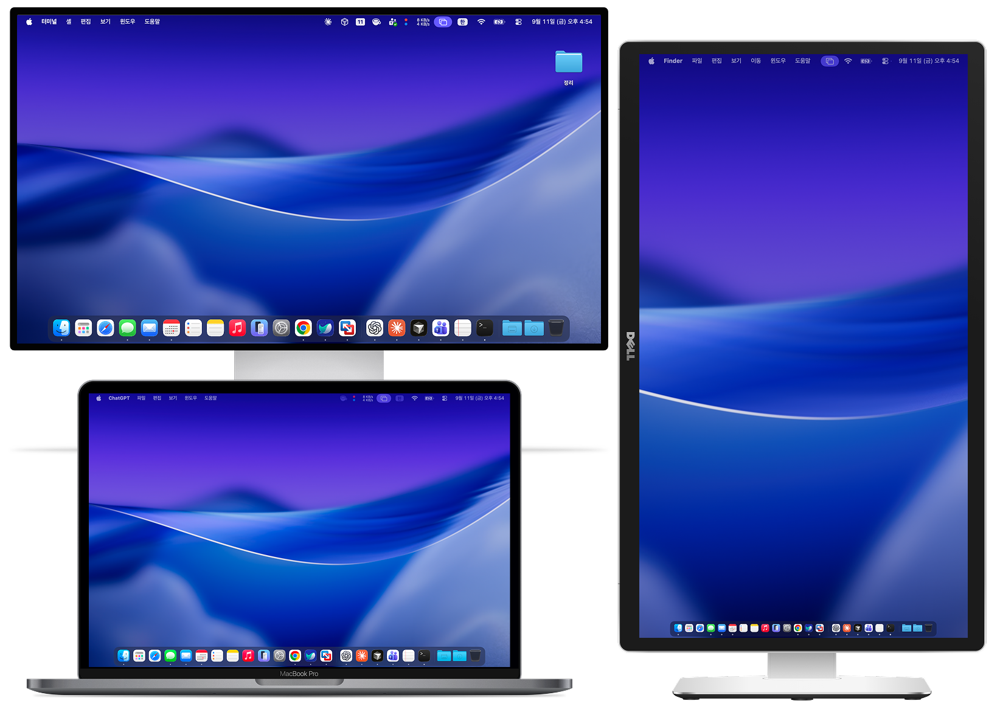

<div align="center">

# `everyDock`

**Your Dock. On every display.**

Keep apps, windows, and everyday files within reach on every monitor.

[](https://github.com/hungryZoo/everyDock/releases) [](#9-license) [](Package.swift)

```bash
brew install --cask hungryZoo/tap/everydock
xattr -dr com.apple.quarantine /Applications/everyDock.app
open -a everyDock
```

**Apple Silicon · macOS 26+ · Homebrew 6**

[First-time setup](#2-installation) · [Usage](#4-usage) · [Latest release](https://github.com/hungryZoo/everyDock/releases)

</div>



---

everyDock puts an app bar on each enabled display, with shared pinned apps and familiar magnification.
Click to launch or switch apps, hover to preview windows, and Command-drag to organize your Dock.
Desktop and Downloads open file stacks, while Apps opens Spotlight’s app browser.
The setup guide explains the permissions and offers launch at login.
**v0.4.0 is an English-language public beta**, ahead of the planned 1.0 release.

---

## Table of Contents

1. [Overview](#1-overview)
   - [How it works](#how-it-works)
2. [Installation](#2-installation)
   - [Homebrew](#homebrew)
   - [Update](#update)
   - [Uninstall and reinstall](#uninstall-and-reinstall)
   - [Manual download](#manual-download)
3. [Quickstart](#3-quickstart)
4. [Usage](#4-usage)
   - [Apps and windows](#apps-and-windows)
   - [Organize your Dock](#organize-your-dock)
   - [Files and Trash](#files-and-trash)
5. [Configuration](#5-configuration)
   - [Permissions](#permissions)
   - [The macOS Dock](#the-macos-dock)
6. [Platform Support](#6-platform-support)
   - [Known limitations](#known-limitations)
7. [Development](#7-development)
8. [Roadmap](#8-roadmap)
9. [License](#9-license)

## 1. Overview

- A persistent Dock on each enabled monitor, with the same pinned app order.
- Magnification, launch bounce, running indicators, and macOS 26 glass styling.
- Click to launch, activate, minimize, or restore app windows.
- Window previews with individual close buttons and **Close All Windows**.
- App-provided Dock commands alongside everyDock’s own right-click menu.
- Pinned apps, custom separators, and a separate section for unpinned running apps.
- Desktop and Downloads stacks with file thumbnails, plus Trash access.
- An English interface, permission setup, and optional launch at login.

The working tree after v0.4.0 improves icon rendering with display-scale-aware cached artwork and trilinear downsampling. Animation reuses the cached image. This change is not yet included in the published Homebrew release; visual checks across mixed-resolution displays are pending.

### How it works

| Part | Behavior |
|---|---|
| Displays | One panel per enabled display; app order is shared across panels. |
| Windows | Accessibility controls supported windows; ScreenCaptureKit provides still previews. |
| Files | Folder contents and thumbnails load asynchronously. |
| macOS Dock | Optional management hides it while everyDock runs and restores its previous settings afterward. |
| Privacy | No accounts, analytics, or network requests. Window previews stay in memory; audio is not recorded. |

<p align="right"><a href="#table-of-contents">↑ back to top</a></p>

## 2. Installation

### Homebrew

Install [Homebrew](https://brew.sh/) first. Homebrew 6 automatically adds the tap and trusts this specific cask when you install using its fully qualified name:

```bash
brew install --cask hungryZoo/tap/everydock
xattr -dr com.apple.quarantine /Applications/everyDock.app
open -a everyDock
```

The app is installed in `/Applications/everyDock.app`. The beta is ad-hoc signed and **not notarized**. The `xattr` step clears the quarantine attribute for this app. If macOS still blocks it, use **System Settings → Privacy & Security → Open Anyway**.

Inspect the package with `brew info --cask hungryZoo/tap/everydock`. Its definition lives in [hungryZoo/homebrew-tap](https://github.com/hungryZoo/homebrew-tap/blob/main/Casks/everydock.rb).

### Update

Quit everyDock, including any development copy, then update. **Upgrade preserves your settings.** Repeat the quarantine step after upgrades while the app remains unnotarized.

```bash
brew update
brew upgrade --cask hungryZoo/tap/everydock
xattr -dr com.apple.quarantine /Applications/everyDock.app
open -a everyDock
```

### Uninstall and reinstall

**Uninstall and `brew reinstall` reset your settings**, including pinned apps, separators, appearance, menu bar visibility, and setup history. The cleanup helper quits everyDock, restores the macOS Dock, unregisters launch at login, and clears app preferences, caches, and saved window state. Cleanup failures stop removal.

```bash
brew uninstall --cask hungryZoo/tap/everydock
```

To start fresh, install again using the Homebrew instructions above. Homebrew stores the removal rules from the installed version: installations older than v0.3.9 need an upgrade before the new cleanup applies. If the app is already gone, remove remaining settings with:

```bash
brew uninstall --cask --zap --force hungryZoo/tap/everydock
```

macOS permission decisions are separate and may remain after removal. Unfinished Dock recovery journals are retained until restoration succeeds. An empty `recovery.lock`, development app copies, and Homebrew’s download cache can remain; they do not store your everyDock options. If the app was removed before its cleanup helper could run, check Login Items in System Settings.

### Manual download

Download the arm64 ZIP and `SHA256SUMS` from [Releases](https://github.com/hungryZoo/everyDock/releases). In the download directory, verify the archive before extracting it:

```bash
shasum -a 256 -c SHA256SUMS
```

Move `everyDock.app` to Applications, then use the same `xattr` and `open` commands shown above. Homebrew cleanup rules apply to Homebrew installations.

<p align="right"><a href="#table-of-contents">↑ back to top</a></p>

## 3. Quickstart

1. Open everyDock. **Welcome to everyDock** appears on first launch or when permission setup is needed.
2. Choose **Open Accessibility Settings** to allow window control. Choose **Allow Screen Recording** when you want window previews.
3. Leave **Launch everyDock at Login** selected if desired, then choose **Get Started**. **Set Up Later** keeps the current login registration unchanged.
4. Use the Dock on either display. Open **everyDock Settings…** to adjust displays, appearance, and pinned apps.

Startup, reopening, and background checks do not request missing Screen Recording permission. The permission button starts that request. Desktop and Downloads can request folder access when you open them.

<p align="right"><a href="#table-of-contents">↑ back to top</a></p>

## 4. Usage

### Apps and windows

| Action | Result |
|---|---|
| Click an app | Launch or activate it. |
| Click the active app again | Minimize its window when enabled and supported. |
| Click an app with minimized windows | Restore its minimized windows. |
| Hover over a running app | Show window previews after the configured delay. |
| Click a preview | Select that exact window. |
| Click a preview’s × | Close that window normally. |
| Right-click or Control-click | Open app-provided commands and everyDock commands together. |
| **Show Windows…** | Open previews immediately, even with hover previews disabled. |
| **Close All Windows** | Close the app’s existing windows, including Finder windows. Stop if a save prompt needs your response. |
| Click **Apps** | Open Spotlight’s app browser. |

App-provided commands require Accessibility access and a matching item in the macOS Dock. Their wording follows the source app. The original system menu may briefly appear while commands are read or dispatched. A changed or unavailable menu keeps everyDock’s regular commands available.

Supported zoomed windows are resized to leave room for everyDock. If everyDock observed their earlier size, another title-bar double-click can restore it with a short transition.

### Organize your Dock

| Action | Result |
|---|---|
| ⌘ Command-drag a pinned app or separator | Collapse magnification and move it to the blue insertion line. |
| ⌘-drag a running app into the pinned section | Pin it at that position. |
| ⌘-drag a pinned app into the running section | Unpin it at the orange indicator. A running app remains in that section. |
| Escape, or drop outside the Dock or over folders | Cancel the move. |
| Right-click between pinned apps | **Add Separator Here**. |
| Right-click a pinned app | Add a separator before or after it. |
| Open **Settings → Pinned Apps** | Reorder or remove apps and separators together. |
| Drop an `.app` on the Dock background | Add it to pinned apps. |

The order is **pinned items → unpinned running apps → folders and Trash**. Separators remain within the pinned section. Bottom Docks read left to right; side Docks read top to bottom. Scroll to your destination before dragging; drag auto-scroll is not implemented.

### Files and Trash

Desktop and Downloads open temporary file stacks, sorted by **date modified, newest first**, with up to 80 visible items. Filename ordering breaks date ties. Supported files show Quick Look thumbnails; folders and unsupported files keep their icons. Reopening a stack retains valid thumbnails while refreshing its contents.

Click a file to open it in its default app, or choose **Open in Finder**. Dropping files onto Desktop or Downloads copies them without replacing existing files. Dropping onto Trash moves them to Trash.

**Empty Trash…** asks for confirmation before permanently deleting items in the current user’s Trash. External-drive Trash is excluded. Cancel is the default response.

<p align="right"><a href="#table-of-contents">↑ back to top</a></p>

## 5. Configuration

| Setting | Default / options |
|---|---|
| Position | Bottom, Left, or Right; default Bottom. |
| Size and magnification | Follow the macOS Dock, or adjust manually. |
| Show Running Apps | On. |
| Show over Full-Screen Apps | On, within macOS restrictions. |
| Displays | All connected displays; individually configurable. |
| Click Active App to Minimize | On. |
| Window previews | On, with a 0.55-second delay; adjustable from 0.2 to 2 seconds. |
| Hide macOS Dock | On for a new configuration; existing choices are preserved. |
| Launch at login | Selected in first-time setup; registered only after **Get Started**. |
| Hide Menu Bar Icon | Off. Reopen everyDock from Apps to return to Settings when hidden. |

Preferences use the `app.everydock.mac` domain and `everyDock.preferences.v1` key. Upgrades preserve stored app paths, separator IDs, and option values. v0.4.0 changes everyDock’s text to English; app names, filenames, window titles, and third-party menu commands retain their original text. macOS permission dialogs follow system language.

### Permissions

| Permission | Used for |
|---|---|
| Accessibility | Window control, window lists, and app-provided Dock menus. |
| Screen Recording | Still window previews; no audio capture. |
| Desktop / Downloads access | File lists and thumbnails for the selected folder. |

**Check Permission Status** reads status without requesting screen capture. **Allow Screen Recording…** explicitly requests access. A denial stops automatic retries. Ordinary app launching, Settings, and Quit remain available without preview permission.

If an upgrade invalidates an earlier approval, quit everyDock, remove its old entry in **Privacy & Security**, and add the current app shown by **Show App Location** in Settings. Repeat separately for Accessibility and Screen & System Audio Recording, then reopen the app.

For a deliberate first-permission test, quit the app and reset only its macOS permission decisions:

```bash
tccutil reset All app.everydock.mac
```

This is a manual testing step, not part of installation or removal.

### The macOS Dock

When management is enabled, everyDock records the original values and key presence for `autohide`, `autohide-delay`, `autohide-time-modifier`, and `mineffect`. It applies auto-hide, a long reveal delay, and the Genie effect, then restarts the macOS Dock.

Normal quit, hiding all Docks, disabling all displays, and turning management off restore the recorded settings. A separate watchdog also attempts restoration after a crash or forced exit. Values changed by the user while everyDock runs are preserved.

Recovery journals live in `~/Library/Application Support/everyDock/`. If both processes stop or power is lost, the next management session retries unfinished recovery. The macOS Dock itself is not disabled.

<p align="right"><a href="#table-of-contents">↑ back to top</a></p>

## 6. Platform Support

| Target | Support |
|---|---|
| Apple Silicon, macOS 26+ | Supported beta target. |
| Intel Macs | Not supported. |
| macOS 25 or earlier | Not supported. |
| Spaces, full-screen apps, Stage Manager | Behavior depends on system settings; the full device matrix remains under testing. |

### Known limitations

- macOS controls the minimize animation and its destination. everyDock cannot route the system Genie animation to a separate icon on each monitor.
- Window resizing uses Accessibility; it does not reserve a global system work area. Unsupported windows and minimum-size constraints can still overlap the Dock. An earlier window size cannot be recovered if it was never observed.
- Protected or minimized windows may show a title, fallback icon, or cached preview.
- Notification badges, individual minimized-window tiles inside the Dock, Mission Control, per-display app lists, and drag auto-scroll are not implemented.
- Locked or secure screens and higher-level system windows can cover everyDock. Selecting an app does not move its windows to the current monitor.
- Reading the macOS Dock’s pins and sizing relies on its preference format. Manual app selection and sizing are available if that format changes.
- The beta does not promise pixel-for-pixel equivalence with Apple’s Dock or complete compatibility with every app’s Accessibility implementation.

<p align="right"><a href="#table-of-contents">↑ back to top</a></p>

## 7. Development

Use Xcode 26+, the macOS 26 SDK, and Swift 6.2+. There are no external Swift package dependencies.

```bash
swift test --arch arm64
EVERYDOCK_RUN_QL_TEST=1 swift test --arch arm64
./scripts/build.sh
open dist/everyDock.app
```

Move the app to Applications before registering launch at login. The build is ad-hoc signed by default. `./scripts/package-release.sh` produces an arm64 ZIP and `SHA256SUMS` in `dist/releases` without overwriting a running development app.

| Path | Purpose |
|---|---|
| `Sources/DockCore` | Preferences, geometry, motion, matching, and recovery models. |
| `Sources/EveryDock` | AppKit panels, controls, app state, window actions, previews, utilities, and SwiftUI settings. |
| `Resources` | Bundle metadata. |
| `Tests` | Model, interaction, consent, and thumbnail regressions. |
| `scripts` | Builds, icon generation, packaging, and signing. |
| [docs](docs/README.md) | [MRD](docs/MRD.md), [PRD](docs/PRD.md), [SRS](docs/SRS.md), [TC](docs/TC.md), and [release procedure](docs/RELEASING.md). |

App events and KVO drive state changes, with a five-second background check as a fallback. Magnification uses a display-linked animation and cached icon layers; frame updates stop when settled. These mechanisms do not establish measured performance on every device. See the [v0.4.0 QA record](docs/QA-v0.4.0.md) for the tests actually performed.

Keep code and documentation aligned in the same change, preserve requirement IDs, and record untested cases honestly. Do not commit user preferences, recovery journals, permission databases, or private window images. See [AGENTS.md](AGENTS.md).

<p align="right"><a href="#table-of-contents">↑ back to top</a></p>

## 8. Roadmap

- [x] English app interface and documentation for the v0.4.0 beta.
- [ ] Complete the display, Spaces, sleep/wake, and app compatibility matrix.
- [ ] Validate permission setup, restoration, file handling, and performance across supported devices.
- [ ] Complete Developer ID signing and notarization.
- [ ] Review remaining release criteria before promoting to v1.0.0.

<p align="right"><a href="#table-of-contents">↑ back to top</a></p>

## 9. License

A software license has not been specified yet. Public source availability does not itself grant a license. Licensing remains a release decision.

<p align="right"><a href="#table-of-contents">↑ back to top</a></p>
